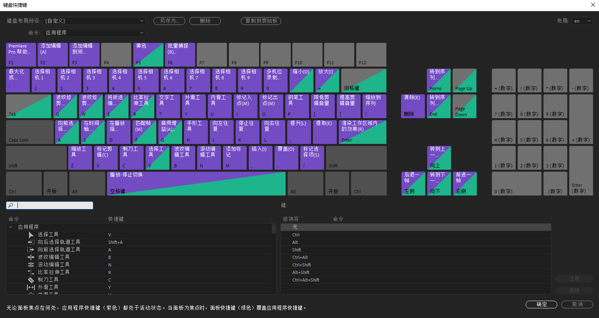
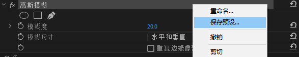
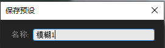
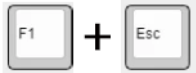

# 下载

百度网盘：

阿里云盘：

Github：

# 基础配置

## 修改快捷键

初次安装完成以后请打开`Premiere`，版本不限。

打开`编辑——快捷键`

在左下角的窗口中找到`窗口 > 选择查找框`和`应用程序 > 窗口 > 效果`

分别将他们的快捷键设置为`CTRL+B`和`CTRL+ALT+SHIFT+7`

按`确定`保存设置。

------

## 保存预设

将常用的效果保存成为一个预设，这里以模糊为例，设置好合适的模糊度以后，

右键保存预设

为预设起名为`“模糊1”`

?> 请确保名字是唯一的，不可重名

------

## 配置prAHK

打开本程序自带的`prAHK设置`

修改其中的效果名，这里将快捷键`Esc`配置为`“模糊1”`

点击`保存`

------

## 测试

打开`prAHK`

回到`Premiere`

把鼠标指向需要添加效果的片段上

为了更好的左手单手操作，`prAHK`的快捷键前置键为`F1`

`按住F1并按下ESC`来触发刚刚设置的效果

此时观察`效果控件`面板，如果`“模糊1”`被添加到视频上了，就大功告成啦

后续可以通过`prAHK设置`来配置更多的效果。

!> 如果没有成功，请参考[这里](疑难解答)的方法解决。
