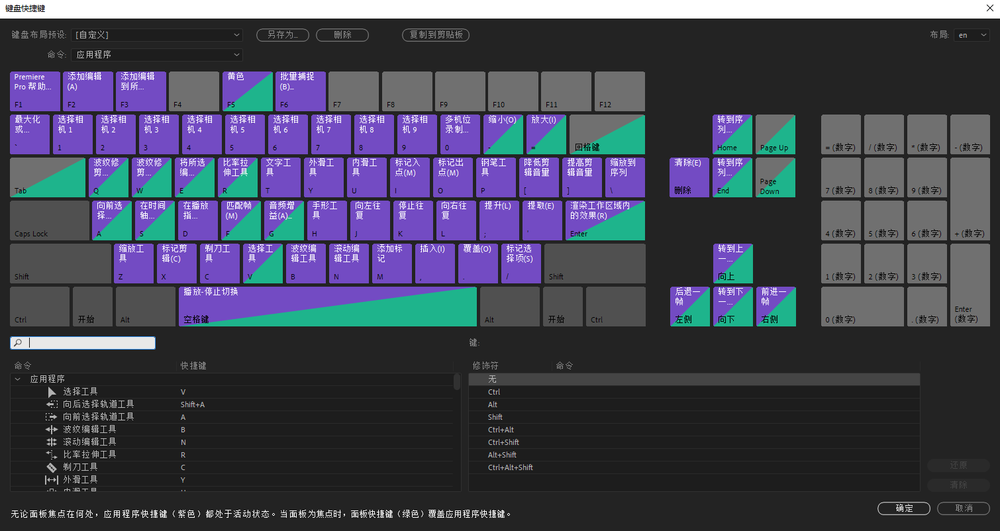
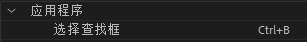
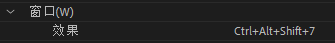
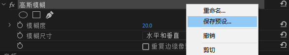
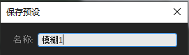
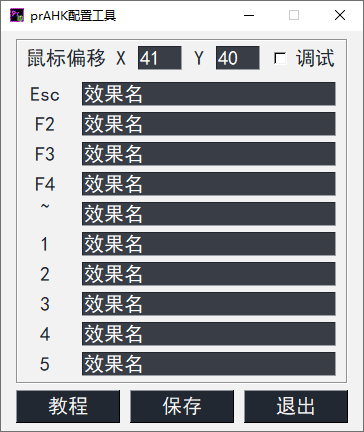
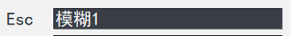
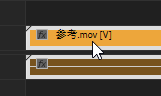
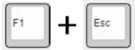
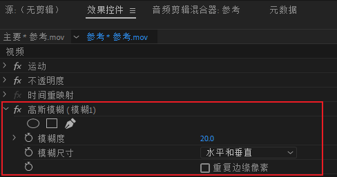

# 简介

------

## **prAHK是什么？**

`prAHK`是由[飘渺酱](https://space.bilibili.com/107540)开发的一款Windows下的一款`Adobe Premiere Pro`辅助工具，可以**用快捷键快速将特效添加到视频片段上**。

> 例如：
>
> 按下F1+F2组合键，添加裁剪效果
>
> 按下F1+F3组合键，添加模糊效果

极大地提高了复杂项目中的视频包装效率，为您节约宝贵的时间。

# 开始配置

------

?> 在初次使用软件的时候需要进行一些设置，配置完成即可使用啦。

## 修改快捷键

初次安装完成以后请打开`Premiere`，版本不限。

打开`编辑——快捷键`

在左下角的窗口中找到`窗口 > 选择查找框`和`应用程序 > 窗口 > 效果`

分别将他们的快捷键设置为`CTRL+B`和`CTRL+ALT+SHIFT+7`

按`确定`保存设置。

------

## 保存预设

将常用的效果保存成为一个预设，这里以模糊为例，设置好合适的模糊度以后，

右键保存预设

为预设起名为`“模糊1”`

!> 请确保名字是唯一的，不可重名

------

## 配置prAHK

!> prAHK只有在Premiere打开并且窗口获得焦点的时候才会激活，Premiere后台或未开启的情况下是不生效的。

打开`prAHK`,软件会自动最小化到托盘图标。此时回到`Premiere`并按下键盘上的F1+E快捷键，将会打开本程序自带的`prAHK配置工具`。

| 快捷键 | 功能     |
| :----- | -------- |
| F1+R   | 重启软件 |
| F1+E   | 打开设置 |
| F1+T   | 退出软件 |

?> 为了更好的左手单手操作，`prAHK`的快捷键前置键为`F1`

修改其中的效果名，这里将快捷键`Esc`配置为`“模糊1”`

点击`保存`并确定，然后退出设置界面。

------

## 开始使用

------

把鼠标指向需要添加效果的片段上

此时`按住F1并按下ESC`来触发刚刚设置的效果

观察`效果控件`面板，如果`“模糊1”`被添加到视频上了，就大功告成啦

后续可以通过`prAHK配置工具`来设置更多的效果。

!> 如果没有成功，请参考[这里](高级配置)的方法解决。
