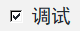
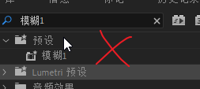
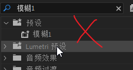
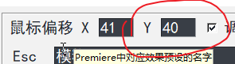
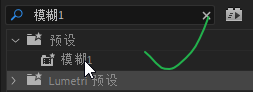

# 高级配置

------

prAHK实现的原理是模拟鼠标拖拽效果到指定的片段上，如果没有成功，可能是因为鼠标定位不准确。不同的屏幕分辨率和缩放大小会导致这个问题，我们可以通过简单调试解决。

打开`prAHK设置`并勾选`调试`，然后点击`保存`。

回到`Premiere`，按下前文中配置的快捷键，例如`F1+ESC`。

此时观察`效果`面板中鼠标所处的位置，如果鼠标没有指向第一个预设

请按回车关闭提示窗口，并调整`prAHK设置`中的鼠标偏移Y轴的值，数值越大位置位置越靠下。调整完毕保存继续测试。

只有当刚好指向预设中的第一个效果时，设置才是正确的。

此时`prAHK`应该可以正常工作了。

!> 如果依然存在问题，可以考虑[寻求帮助](寻求帮助)

# 更多知识

- prAHK将会占用Premiere原本的F1功能，也就是呼出帮助菜单。
